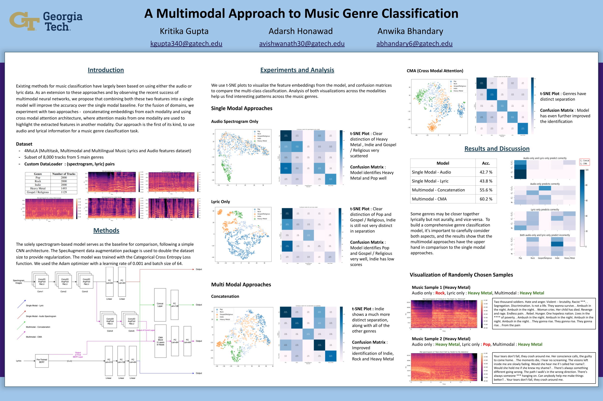

# multi-modal-music-genre-classification

Final project for CS 7643 : Deep Learning (Fall 2022, Georgia Tech)

Abstract: Music classification tasks such as genre or mood classification have been tackled previously using the audio or the lyrics separately. While many of these have been fairly successful, it appears to be more intuitive to approach these tasks by combining both components of music. Our goal is to train a multimodal based model that uses both the audio spectrograms and lyrics of songs to predict their genre. We use the 4MULA dataset to train single modal approaches using audio spectrogram only and lyrics only, along with multimodal approaches like concatenation and CMA (Cross Modal Attention), and compare their performances through several experiments and visualizations.

